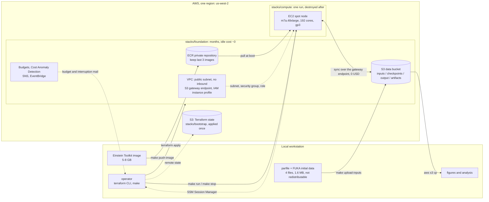
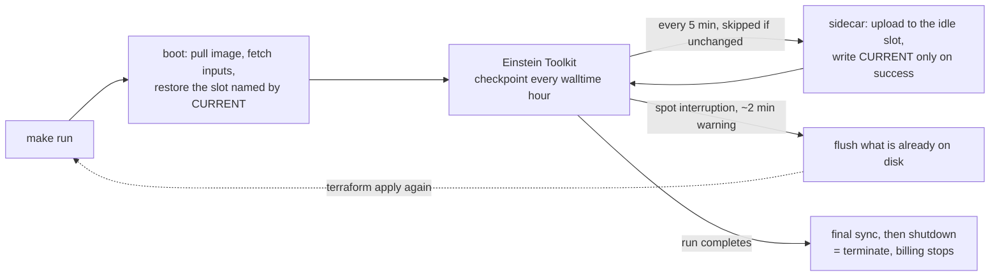

# GW230529 Einstein Toolkit — AWS infrastructure

Terraform for the cloud half of the [GW230529 BH-NS
simulation](https://github.com/s-sasaki-earthsea-wizard/gw230529-einstein-toolkit):
a single spot compute node, an S3 bucket that acts as the system of record,
a private registry for the Einstein Toolkit image, and the cost guardrails
that keep the whole project inside a 300 USD cap.

## Architecture



Four properties the picture is meant to make obvious:

- **S3 is the system of record; EBS is scratch.** The node holds nothing that
  matters for longer than one sync interval, so losing it to a spot
  interruption costs minutes, not a run.
- **The stacks are split by lifetime, not by environment.** `foundation` bills
  ~1 USD/month and stays; `compute` is created for a run and destroyed after.
  A `destroy` in `compute` cannot reach the data or the image — they are not
  in that state file.
- **Nothing listens.** The security group has no ingress rules; operator
  access is SSM Session Manager, which the node opens outbound.
- **The two artefacts the image does not carry** — the parfile and the FUKA
  initial data — arrive from the private bucket at boot. They are Einstein
  Toolkit gallery files, so they are neither committed here nor baked into
  ECR.

### During a run



Checkpoints alternate between `checkpoints/slot-a/` and `checkpoints/slot-b/`,
which holds S3 at about 312 GB instead of the 5.9 TB a push-only mirror would
accumulate over a 76 hour run. A push mirrors the whole checkpoint directory
into a slot, so the sidecar also prunes the volume to two generations after
each successful push — without that the volume fills at six generations and
ends the run, which Cactus will not prevent on its own. `CURRENT` is written only after an upload
returns success, so a node reclaimed mid-upload leaves a torn set that restore
will not select — a timestamp would have picked exactly that set, because it
is the newest.

[docs/architecture.md](docs/architecture.md) carries the detailed diagrams and
the reasoning behind each choice: the region and instance measurements, why a
public subnet, the checkpoint interval arithmetic, and the known operational
hazards.

## Layout

```text
stacks/
  bootstrap/    S3 bucket holding the state of the other stacks. Applied once.
  foundation/   VPC, data bucket, ECR, IAM, budgets. Lives for months, idle cost ~0.
  compute/      Spot instance and launch template. Created per run, destroyed after.
modules/
  network/      VPC, public subnets, internet gateway, S3 gateway endpoint, security group
  storage/      Data bucket and its per-prefix lifecycle rules
  registry/     ECR repository and image retention
  iam/          Instance role: SSM, one ECR repository, one S3 bucket
  cost_guard/   Budgets, Cost Anomaly Detection, SNS (us-east-1)
  spot_node/    Launch template, spot instance, interruption alerting
templates/
  user_data.sh.tftpl   Node bootstrap: pull image, restore state, sync, self-terminate
scripts/
  fetch_inputs.sh      Download the gallery artefacts, checksum pinned
  upload_inputs.sh     Derive the cloud parfile, check it, upload it
  region_scout.sh      Compare regions on spot score, price and vCPU quota
  check_permissions.sh Simulate every IAM action the stacks need, creating nothing
  check_secrets.sh     Fail if a tracked file carries an account id or ARN
  check_alerts.sh      Fail unless both SNS topics still have a confirmed subscriber
policies/
  terraform-operator.json   The single IAM policy the Terraform principal needs
```

The stacks are split by lifetime, not by environment. `terraform destroy` in
`stacks/compute` tears down the instance without the simulation bucket or the
container image ever entering the plan.

## Requirements

- Terraform >= 1.11 — the S3 backend locks through a lock file object, so no
  DynamoDB table is needed
- AWS CLI v2 with a configured profile. **Not the account root user** — root
  cannot be bounded by IAM, so a mistaken `destroy` or a runaway `for_each`
  has no ceiling. Use an IAM user or role and verify it with
  `make check-permissions`.
- An IAM principal carrying [policies/terraform-operator.json](policies/terraform-operator.json) —
  a single policy scoped to `gw230529-*` resources, with an explicit Deny that
  keeps destructive EC2 actions off anything not tagged `Project=gw230529`.
  See [policies/README.md](policies/README.md) for what can and cannot be
  scoped, and why
- Spot vCPU quota (`L-34B43A08`) of at least 192 in the chosen region.
  `make region-scout` reports the current value; us-east-1 and us-west-2
  commonly sit at 256 already, us-east-2 at 5

## First run

```bash
make setup             # create .env, backend.hcl and terraform.tfvars from templates
                       # then edit every CHANGEME value

make check-permissions # confirm the operator can do everything, creating nothing
make region-scout      # compare candidate regions before committing to one

make init-bootstrap && make apply-bootstrap
make init-foundation && make apply-foundation
                       # then click "Confirm subscription" in both mails
make check-alerts      # and verify the alerts can actually be delivered

make push-image        # push the locally built Einstein Toolkit image to ECR
make fetch-inputs      # download the gallery parfile and FUKA initial data
make upload-inputs     # derive the cloud parfile from it and upload

make init-compute
make run               # launch the spot node
make ssm               # open a shell on it
make stop              # terminate it
```

`fetch-inputs` and `upload-inputs` are not optional for a simulation run. The
parfile and the FUKA initial data are Einstein Toolkit gallery artefacts, so
they are neither committed here nor baked into the container image; this
repository keeps only their URLs and checksums, `fetch-inputs` downloads them
into a gitignored `upstream/`, and the node reads them from the private bucket
at boot.

`upload-inputs` does not upload the gallery parfile as it stands. That file is
written for COSMA8, where a checkpoint every 29 hours is free because jobs are
capped at 30; on a spot instance it would cost 14.5 hours of lost work per
interruption. The cloud variant is derived from it — hourly checkpoints, and
`checkpoint_ID` turned on so an interruption does not re-import the FUKA data
— and the result is checked for the four settings a run needs to survive being
reclaimed. If any of them is wrong, nothing is uploaded. See
[docs/architecture.md](docs/architecture.md#what-the-node-needs-that-the-image-does-not-carry).

Phase 4 is different: it runs `run_mode = "ops-rehearsal"`, which does no
physics at all and needs no inputs. A 16 GiB instance cannot hold any grid
that both fits and runs, so the rehearsal exercises the operational paths —
slot rotation, interruption flush, restore — with a synthetic payload instead.

Two manual steps have no Terraform equivalent:

1. **Confirm the SNS subscriptions.** The first `apply-foundation` sends a
   confirmation mail for each of the two topics. Until the "Confirm
   subscription" links are clicked, no alert is delivered.

   This stays true afterwards, which is the awkward part: every message SNS
   sends carries an unsubscribe link, one click deletes the subscription, and
   nothing announces that the alerts have stopped. `make check-alerts` reports
   what each topic can actually deliver, and `make run` refuses to start
   billing when either is disarmed — override with `SKIP_ALERT_CHECK=1` if
   that is ever the wrong call.
2. **Activate the `Project` cost allocation tag** in the Billing console, if
   and when the budgets are narrowed to that tag. Leave
   `cost_allocation_tag` unset until then — a budget filtered on an
   unactivated tag matches nothing and silently never fires.

## Cost model

| Item | Cost |
| --- | --- |
| VPC, subnets, internet gateway, S3 gateway endpoint, security groups, IAM | 0 |
| Budgets, Cost Anomaly Detection, SNS | 0 |
| ECR, 5–8 GB image | ~0.8 USD/month |
| S3 standard storage | ~0.023 USD/GB-month |
| S3 Glacier Deep Archive | ~0.001 USD/GB-month, 180 day minimum |
| Spot node | billed only while a run is active |

Nothing in `stacks/foundation` bills by the hour, so the project can sit idle
between phases without spending.

The production run is the only large item. The reference run costs about
14,600 core-hours to reach the target evolution time, which on 192 cores is
38–76 hours depending on how much faster a Genoa core is than the reference
cluster's — 113–226 USD on c7a.48xlarge, 142–285 USD on m7a.48xlarge.

m7a is the planning default despite costing 26% more per core: the reference
run reports 438.5 GB of memory across its nodes, and c7a.48xlarge has 384 GiB.
Which one actually runs Phase 6 is decided by the Phase 5 measurement, not
assumed here. See
[docs/architecture.md](docs/architecture.md#choosing-the-instance-type).

The budget alerts are after the fact — AWS billing data lags 8–24 hours. Real
time containment comes from two places instead: the spot request is capped at
the on-demand price, and the node terminates itself when the run exits.

## Public repository hygiene

Account identifiers are kept out of git: `*.tfvars`, `backend.hcl`, `.env` and
all state files are ignored, and each has a tracked `.example` counterpart.
Backend settings are supplied through partial configuration
(`terraform init -backend-config=backend.hcl`).

`make check-secrets` fails the build if a tracked file gains a 12-digit
account id, an ARN, or an access key. This is defence in depth rather than a
security boundary — an account id is not a credential. The boundary is IAM.

`.terraform.lock.hcl` **is** tracked: it pins provider checksums and contains
nothing account-specific.

## Licence

GPL-2.0-or-later. See [LICENSE](LICENSE).
