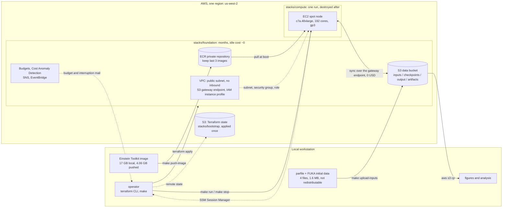
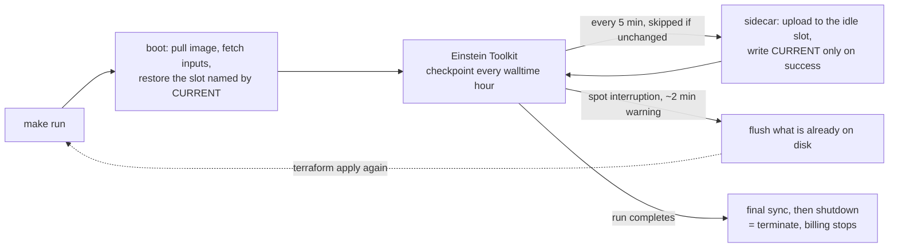

# GW230529 Einstein Toolkit — AWS infrastructure

Terraform for the cloud half of the [GW230529 BH-NS
simulation](https://github.com/s-sasaki-earthsea-wizard/gw230529-einstein-toolkit):
a single spot compute node, an S3 bucket that acts as the system of record,
a private registry for the Einstein Toolkit image, and the cost guardrails
that keep the whole project inside a 300 USD cap.

Design reasoning lives in [docs/](docs/); every **measured number** — memory,
checkpoint sizes, import times, throughput — lives in the
[project wiki](https://github.com/s-sasaki-earthsea-wizard/gw230529-einstein-toolkit-aws-tf/wiki),
each figure stamped with the conditions it was taken under.

## Architecture



Four properties the picture is meant to make obvious:

- **S3 is the system of record; EBS is scratch.** The node holds nothing that
  matters for longer than one sync interval, so losing it to a spot
  interruption costs minutes, not a run.
- **The stacks are split by lifetime, not by environment.** `foundation` bills
  ~1 USD/month and stays; `compute` is created for a run and destroyed after.
  A `destroy` in `compute` cannot reach the data or the image — they are not
  in that state file.
- **Nothing listens.** The security group has no ingress rules; operator
  access is SSM Session Manager, which the node opens outbound.
- **The two artefacts the image does not carry** — the parfile and the FUKA
  initial data — arrive from the private bucket at boot. They are Einstein
  Toolkit gallery files, so they are neither committed here nor baked into
  ECR.

### During a run



Checkpoints alternate between `checkpoints/slot-a/` and `checkpoints/slot-b/`,
which holds S3 at about 312 GB instead of the 5.9 TB a push-only mirror would
accumulate over a 76 hour run. A push mirrors the whole checkpoint directory
into a slot, so the sidecar also prunes the volume to two generations after
each successful push — without that the volume fills at six generations and
ends the run, which Cactus will not prevent on its own. `CURRENT` is written only after an upload
returns success, so a node reclaimed mid-upload leaves a torn set that restore
will not select — a timestamp would have picked exactly that set, because it
is the newest.

[docs/architecture.md](docs/architecture.md) carries the detailed diagrams and
the reasoning behind each choice: the region and instance measurements, why a
public subnet, the checkpoint interval arithmetic, and the known operational
hazards.

## Layout

```text
stacks/
  bootstrap/    S3 bucket holding the state of the other stacks. Applied once.
  foundation/   VPC, data bucket, ECR, IAM, budgets. Lives for months, idle cost ~0.
  compute/      Spot instance and launch template. Created per run, destroyed after.
modules/
  network/      VPC, public subnets, internet gateway, S3 gateway endpoint, security group
  storage/      Data bucket and its per-prefix lifecycle rules
  registry/     ECR repository and image retention
  iam/          Instance role: SSM, one ECR repository, one S3 bucket
  cost_guard/   Budgets, Cost Anomaly Detection, SNS (us-east-1)
  spot_node/    Launch template, spot instance, interruption alerting
templates/
  user_data.sh.tftpl   Node bootstrap: pull image, restore state, sync, self-terminate
scripts/
  fetch_inputs.sh      Download the gallery artefacts, checksum pinned
  upload_inputs.sh     Derive the cloud parfile, check it, upload it
  region_scout.sh      Compare regions on spot score, price and vCPU quota
  check_permissions.sh Simulate every IAM action the stacks need, creating nothing
  check_secrets.sh     Fail if a tracked file carries an account id or ARN
  check_alerts.sh      Fail unless both SNS topics still have a confirmed subscriber
policies/
  terraform-operator.json        The single IAM policy the Terraform principal needs
  terraform-bootstrap-user.json  What the IAM user itself keeps: assume the two
                                 project roles, and rotate its own access key
```

The stacks are split by lifetime, not by environment. `terraform destroy` in
`stacks/compute` tears down the instance without the simulation bucket or the
container image ever entering the plan.

## Requirements

- Terraform >= 1.11 — the S3 backend locks through a lock file object, so no
  DynamoDB table is needed
- AWS CLI v2 with a configured profile. **Not the account root user** — root
  cannot be bounded by IAM, so a mistaken `destroy` or a runaway `for_each`
  has no ceiling. Use an IAM user or role and verify it with
  `make check-permissions`.
- An IAM principal carrying [policies/terraform-operator.json](policies/terraform-operator.json) —
  a single policy scoped to `gw230529-*` resources, with an explicit Deny that
  keeps destructive EC2 actions off anything not tagged `Project=gw230529`.
  See [policies/README.md](policies/README.md) for what can and cannot be
  scoped, and why
- For watching a run rather than changing one, nothing beyond the same key:
  `stacks/foundation` creates a read-only `gw230529-observer` role that is
  assumed without MFA. See [Watching a run without MFA](#watching-a-run-without-mfa)
- Spot vCPU quota (`L-34B43A08`) of at least 192 in the chosen region.
  `make region-scout` reports the current value; us-east-1 and us-west-2
  commonly sit at 256 already, us-east-2 at 5

## First run

```bash
make setup             # create .env, backend.hcl and terraform.tfvars from templates
                       # then edit every CHANGEME value

eval "$(make login)"   # assume the operator role with MFA
                       # Terraform cannot prompt for an MFA token itself, so the
                       # session goes in the environment. fmt, validate,
                       # check-secrets and check need no session at all.

make check-permissions # confirm the operator can do everything, creating nothing
make region-scout      # compare candidate regions before committing to one

make init-bootstrap && make apply-bootstrap
make init-foundation && make apply-foundation
                       # then click "Confirm subscription" in both mails
make check-alerts      # and verify the alerts can actually be delivered

make push-image        # push the locally built Einstein Toolkit image to ECR
make fetch-inputs      # download the gallery parfile and FUKA initial data
make upload-inputs     # derive the cloud parfile from it and upload

make init-compute
eval "$(make login)"   # assume the operator role with MFA -- needed by every
                       # target below, and by every terraform command
make run               # launch the spot node
make ssm               # open a shell on it
make throughput        # read sec/iter and the cost projection out of the run log
make stop              # terminate it
```

To measure rather than to run, `make upload-probe PROBE_MINUTES=90` uploads a
second parfile alongside the production one. It is the production parfile with
its termination condition changed from a physical time it will never reach to
a wall clock cap it certainly will, which is the only thing bounding what a
probe bills: `auto_shutdown` fires when the run exits, and a full resolution
run does not exit for days. Point `parfile` at it in
`stacks/compute/terraform.tfvars` and the node ends itself on schedule.

`fetch-inputs` and `upload-inputs` are not optional for a simulation run. The
parfile and the FUKA initial data are Einstein Toolkit gallery artefacts, so
they are neither committed here nor baked into the container image; this
repository keeps only their URLs and checksums, `fetch-inputs` downloads them
into a gitignored `upstream/`, and the node reads them from the private bucket
at boot.

`upload-inputs` does not upload the gallery parfile as it stands. That file is
written for COSMA8, where a checkpoint every 29 hours is free because jobs are
capped at 30; on a spot instance it would cost 14.5 hours of lost work per
interruption. The cloud variant is derived from it — hourly checkpoints, and
`checkpoint_ID` turned on so an interruption does not re-import the FUKA data
— and the result is checked for the four settings a run needs to survive being
reclaimed. If any of them is wrong, nothing is uploaded. See
[docs/architecture.md](docs/architecture.md#what-the-node-needs-that-the-image-does-not-carry).

Phase 4 is different: it runs `run_mode = "ops-rehearsal"`, which does no
physics at all and needs no inputs. A 16 GiB instance cannot hold any grid
that both fits and runs, so the rehearsal exercises the operational paths —
slot rotation, interruption flush, restore — with a synthetic payload instead.

Three manual steps have no Terraform equivalent:

0. **Rotate the operator access key.** The role, its trust policy and the MFA
   condition are all in `stacks/bootstrap`; the key itself deliberately is not.
   `aws_iam_access_key` writes the secret into Terraform state in plaintext,
   and the state bucket is versioned, so it would survive in every past
   version of the file after any attempt to remove it. Worse, the credential
   Terraform authenticates with would then be managed by Terraform: an apply
   that fails half way leaves no working credential, and the state lock sits
   in the bucket that credential just lost access to.

   The policy, the role and the trust relationship are declarative facts and
   belong in code. A secret is not a declarative fact.

   ```bash
   aws iam create-access-key --user-name gw230529     # a user may hold two
   # put the new one in ~/.aws/credentials under [gw230529-bootstrap]
   eval "$(make login)" && make check-permissions     # prove it is equivalent
   aws iam update-access-key --user-name gw230529 --access-key-id <old> --status Inactive
   # leave it inactive for a day, then
   aws iam delete-access-key --user-name gw230529 --access-key-id <old>
   ```

   Deactivate before deleting. Inactive is reversible and deletion is not, and
   the gap is where a forgotten copy of the old key announces itself.

   How often this needs doing is no longer very interesting, which is the
   point of the role: on its own the key cannot assume anything and has no
   permissions of its own, so a leak is a nuisance rather than an incident.

1. **Confirm the SNS subscriptions.** The first `apply-foundation` sends a
   confirmation mail for each of the two topics. Until the "Confirm
   subscription" links are clicked, no alert is delivered.

   This stays true afterwards, which is the awkward part: every message SNS
   sends carries an unsubscribe link, one click deletes the subscription, and
   nothing announces that the alerts have stopped. `make check-alerts` reports
   what each topic can actually deliver, and `make run` refuses to start
   billing when either is disarmed — override with `SKIP_ALERT_CHECK=1` if
   that is ever the wrong call.
2. **Activate the `Project` cost allocation tag** in the Billing console, if
   and when the budgets are narrowed to that tag. Leave
   `cost_allocation_tag` unset until then — a budget filtered on an
   unactivated tag matches nothing and silently never fires.

   The cost of leaving it unset is that the budget measures the whole
   account, so spend from anything else on it counts against every
   threshold. That produced a false alarm on 2026-08-27; see *Why the budget
   measures the calendar year* below.

### Watching a run without MFA

`gw230529-terraform-operator` requires MFA, which is the right answer for
anything that changes infrastructure and the wrong one for watching it. During
the 2026-08-26 recovery test every call that blocked was read-only — the
`CURRENT` marker, a slot listing, the bootstrap log while the run was in
flight, `make throughput`, `make heartbeat`, `DescribeInstances` to tell
"finished" from "stuck" — and each one had to be relayed to whoever was
holding the MFA device.

`stacks/foundation` therefore also creates `gw230529-observer`: the same IAM
user, no MFA condition, and read access to the data bucket, the foundation and
compute state files, four EC2 describes, CloudWatch metrics and Cost Explorer.
Nothing it carries can create, change, destroy or spend.

```bash
make output-foundation   # copy observer_profile_snippet into ~/.aws/config
```

```ini
[profile gw230529-observer]
role_arn       = arn:aws:iam::<account>:role/gw230529-observer
source_profile = gw230529-bootstrap
region         = us-west-2
```

```bash
make throughput AWS_PROFILE=gw230529-observer
make heartbeat  AWS_PROFILE=gw230529-observer
aws s3 ls s3://<data-bucket>/checkpoints/<run>/slot-b/ --profile gw230529-observer
```

Run those from a shell that has **not** run `eval "$(make login)"`. An operator
session already in the environment wins over `AWS_PROFILE`, and since the
operator can do everything the observer can, the difference never surfaces as
an error — a check meant to prove the observer works would pass without using
it. `makefiles/tf.mk` carries the `env -u` form for when that is unavoidable.

What the role costs: before it, an access key leaked on its own bought nothing
whatsoever, because the only role it could reach demanded a second factor.
Afterwards the same key buys read access to simulation output, checkpoints and
two state files. That is a deliberate trade, argued in
[stacks/foundation/observer_role.tf](stacks/foundation/observer_role.tf) along
with the alternative that was rejected — pointing the operator profile at a
`credential_process` that generates the TOTP code from a stored seed, which
satisfies `aws:MultiFactorAuthPresent` while putting both factors on one disk
under one uid.

## Cost model

| Item | Cost |
| --- | --- |
| VPC, subnets, internet gateway, S3 gateway endpoint, security groups, IAM | 0 |
| Budgets, Cost Anomaly Detection, SNS | 0 |
| ECR, 4.06 GB image (measured 2026-08-20) | 0.41 USD/month |
| S3 standard storage | ~0.023 USD/GB-month |
| S3 Glacier Deep Archive | ~0.001 USD/GB-month, 180 day minimum |
| Spot node | billed only while a run is active |

Nothing in `stacks/foundation` bills by the hour, so the project can sit idle
between phases without spending.

The production run is the only large item, and it is now measured rather than
projected. A 90 minute probe at full resolution on 2026-08-21 read **4.16
sec/iter** at dt = 0.06 M. The production end point is **t = 1750 M** (decided
2026-08-27): the remnant disc settles by merger + ~180 M and the reference is
essentially flat well before 2000 M, while 1500 M would end right on the
ringdown's heels at the r = 500 extraction radius. 29,167 iterations —
**33.7 hours, ~100 USD on c7a.48xlarge**. The gallery's 2000 M would be 38.5
hours and 115 USD; `CCTK_FINAL_TIME` overrides the end point at upload time.

The measured rate replaces an extrapolation of 38–76 hours and 113–226 USD,
and lands just past its optimistic end: a Genoa core is 2.07× the reference
cluster's, where 1.5–2× was assumed.

Two conditions belong with the number. The rate carries every overhead the
probe paid — the hourly 85.7 GB checkpoint costs 76 seconds of stopped ranks,
the 2D output 31 seconds per 1024 iterations — but the probe covered t = 0–63
M, which is pure inspiral. The merger is not in it; the dx=28 dry run crossed
its merger with no visible slowdown, so this is residual risk rather than
expected cost. Read the live log with `make throughput` while the production
run is going rather than assuming the rate holds.

c7a.48xlarge is the production type on measurement too. A full resolution 192
rank run measured 137 GiB across the node, 37% of c7a's 384 GiB — first on
m7a.48xlarge on 2026-08-20 and then reproduced on c7a itself. The reference
run's 438.5 GB is a scheduler high water mark over 480 ranks on 12 nodes,
which duplicates far more ghost zones than one node at 192 does.
m7a.48xlarge (768 GiB) is the fallback. See
[docs/architecture.md](docs/architecture.md#choosing-the-instance-type).

Starting a run costs about 18 minutes before the first evolution step: 5.7
minutes of FUKA import, 7.6 minutes of iteration 0 analysis and output, and 86
seconds to write the initial data checkpoint. That is what an interruption
costs when `IO::checkpoint_ID` is not set.

The budget alerts are after the fact — AWS billing data lags 8–24 hours. Real
time containment comes from two places instead: the spot request is capped at
the on-demand price, and the node terminates itself when the run exits.

### Why the budget measures the calendar year

`budget_period_start` says `2026-08-01_00:00` and AWS ignores it. An
`ANNUALLY` budget is measured over the calendar year; the start date is
accepted, stored, and read back unchanged, so `terraform plan` reports no
drift and nothing in the configuration hints at the override. Combined with an
empty `cost_filter`, that means every threshold is measured against
everything the account has spent since January 1st.

On 2026-08-27 the 150 USD threshold fired while this project had spent 17.34
USD. The other 137.32 came from a previous project's NAT gateway and RDS
instance, torn down in April, still inside the same calendar year.

`preexisting_spend_usd` compensates: it is added to the cap and to every
threshold, so both keep reading as project spend while AWS keeps counting the
year. It holds 140 for 2026 — the 137.32 measured with Cost Explorer, plus
room for the ~0.08 USD/day of unrelated spend that continues.

**Reset it to 0 on 2027-01-01**, when the calendar year rolls over and that
spend leaves the budget period, or if a cost filter is ever enabled.

## Public repository hygiene

Account identifiers are kept out of git: `*.tfvars`, `backend.hcl`, `.env` and
all state files are ignored, and each has a tracked `.example` counterpart.
Backend settings are supplied through partial configuration
(`terraform init -backend-config=backend.hcl`).

`make check-secrets` fails the build if a tracked file gains a 12-digit
account id, an ARN, or an access key. This is defence in depth rather than a
security boundary — an account id is not a credential. The boundary is IAM.

`.terraform.lock.hcl` **is** tracked: it pins provider checksums and contains
nothing account-specific.

## Licence

GPL-2.0-or-later. See [LICENSE](LICENSE).
