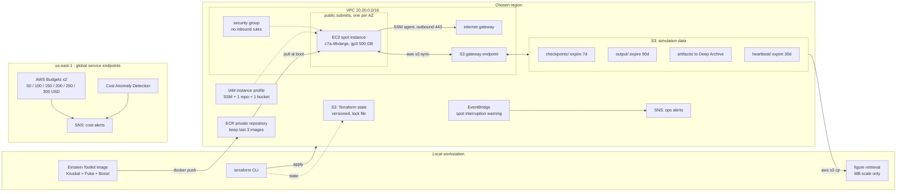
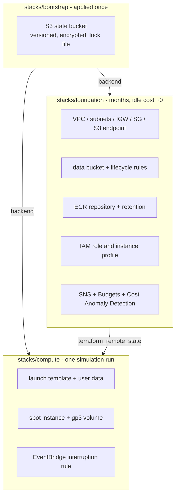

# Architecture

Cloud execution environment for the GW230529 BH-NS merger simulation
(Phases 4–6 of the [simulation
repository](https://github.com/s-sasaki-earthsea-wizard/gw230529-einstein-toolkit)).

Constraints that shaped every decision:

- **300 USD total budget.** Anything that bills by the hour while idle is out.
- **Single spot node.** No multi-node, no EFA. The reference run is 256 cores
  of pure MPI for 30 hours; a 192 vCPU instance is the closest single-machine
  equivalent.
- **S3 is the system of record.** EBS is scratch. A spot interruption must
  never lose more than one sync interval of work.
- **No inbound ports.** Operations go through SSM Session Manager.

## Resource topology



### Why a public subnet

The node needs outbound access for the SSM agent and inbound access for
nothing. Both private-subnet designs cost real money against a 300 USD cap:

| Option | Idle cost | Verdict |
| --- | --- | --- |
| Public subnet + internet gateway + S3 gateway endpoint | **0 USD/month** | adopted |
| Private subnet + NAT gateway | ~33 USD/month plus data processing | rejected |
| Private subnet + 5 interface endpoints | ~36 USD/month | rejected |

A public subnet with an empty ingress rule set has the same effective exposure
as a private one: no port is reachable. The S3 gateway endpoint is free and
keeps sync traffic off the internet gateway entirely, which also removes any
path to an accidental egress charge.

## Region and instance selection

The region is effectively permanent — ECR images and S3 objects are
region-bound, so moving means re-pushing 5–8 GB and re-uploading every result.
`make region-scout` produces the three numbers the decision rests on.

Measured 2026-08-19, target capacity 192 vCPU, single availability zone,
scored across c7a/m7a/c7i .48xlarge:

| Region | Zones scoring 9 | Cheapest c7a.48xlarge | Spot vCPU quota |
| --- | --- | --- | --- |
| us-west-2 | 3 of 4 | 2.970 USD/h (us-west-2d) | 256 |
| us-east-1 | 4 of 6 | 2.996 USD/h (us-east-1a) | 256 |
| us-east-2 | 2 of 3, one at 6 | 2.572 USD/h (us-east-2a) | **5** |

**us-east-2 is out**: cheapest by ~15%, but the spot vCPU quota is 5, and a
quota increase takes hours to days to approve. Over a 30 hour run the saving
is about 13 USD.

**us-west-2 over us-east-1.** Capacity is not the differentiator — both score
9 with the quota already raised. The averages across their viable zones are
3.11 USD/h for us-west-2 against 3.32 for us-east-1, roughly 6 USD over a 30
hour run: also not the differentiator. What decides it is that us-west-2's
fallback zones stay near its cheapest (3.05 and 3.32 against 2.97), whereas
us-east-1's jump to 3.49 and 3.52. Being pushed off the preferred zone costs
less. us-east-1 also concentrates a disproportionate share of AWS-wide
capacity events; one fewer scoring zone is a smaller risk than that.

Preferred zone **us-west-2d** (`usw2-az4`), then `us-west-2a`, then
`us-west-2c`. Zone names are shuffled per account — the IDs are what stay
put, and `make region-scout` prints the mapping.

### Why c7a and not c7i

The instance types are not interchangeable at equal vCPU count:

| Type | 192 vCPU means | Memory channels | Memory |
| --- | --- | --- | --- |
| c7a.48xlarge | 192 physical AMD Genoa cores, SMT off | 12 × DDR5 | 384 GiB |
| m7a.48xlarge | 192 physical AMD Genoa cores, SMT off | 12 × DDR5 | 768 GiB |
| c7i.48xlarge | 96 physical Intel SPR cores + hyperthreading | 8 × DDR5 | 384 GiB |

A pure-MPI run at np=192 on c7i gets 96 real cores, and a bandwidth-bound
spacetime evolution feels the missing four memory channels on top of that.
c7i is scored by the scout for comparison only. In us-west-2 it is also
dearer than c7a (3.09–4.23 against 2.97–3.33), so the trade never arises
there.

m7a is the capacity fallback: identical cores, twice the memory, 20–35%
dearer. Worth reaching for if the 140 GB estimate turns out low.

## Stack lifetimes



Splitting by lifetime rather than by environment buys three things:

1. `terraform destroy` on `compute` cannot reach the simulation data or the
   container image — they are not in that state file.
2. `foundation` can sit between phases without billing.
3. Re-launching after a spot interruption is a single `terraform apply`.

## Run lifecycle

```mermaid
sequenceDiagram
  autonumber
  participant OP as Operator
  participant TF as Terraform
  participant EC2 as Spot node
  participant S3 as S3 data bucket

  OP->>TF: make run
  TF->>EC2: launch from template
  EC2->>EC2: install docker, pull image from ECR
  EC2->>S3: sync checkpoints down (empty on a fresh run)
  EC2->>EC2: start simulation, sync timer, heartbeat timer, spot watcher

  loop every sync interval
    EC2->>S3: push checkpoints and output
  end

  alt spot interruption
    EC2->>EC2: metadata service returns spot/instance-action
    EC2->>S3: flush what is already on disk
    Note over EC2: about 2 minutes; no new checkpoint is requested
    EC2--xEC2: reclaimed by AWS
    OP->>TF: make run
    TF->>EC2: relaunch
    EC2->>S3: sync checkpoints down, resume via recover=autoprobe
  else run completes
    EC2->>S3: final sync
    EC2--xEC2: shutdown, terminating the instance
  end
```

The interruption path deliberately does **not** ask Cactus for a fresh
checkpoint. Phase 2 measured a 25 GB checkpoint at dx=28, which extrapolates
to about 78 GB at production resolution — minutes to write and minutes more to
upload, against a two minute warning. Attempting it would risk the flush of
the checkpoint that already exists. The recovery point is the last checkpoint
that finished uploading.

## Checkpoint synchronisation

Two properties matter more than the sync interval, and both come from the
78 GB figure.

**S3 holds two generations, not all of them.** A push-only mirror would
accumulate every checkpoint Cactus writes — 60 generations over a 30 hour run
at hourly checkpoints, 4.7 TB, roughly 25 USD until the lifecycle rule expires
it. That is 8% of the project budget spent on copies nothing will ever read.
The sidecar instead alternates between `checkpoints/slot-a/` and
`checkpoints/slot-b/`, holding S3 at about 156 GB.

**A `CURRENT` marker, not a timestamp, decides what gets restored.** Uploading
78 GB takes minutes, so an instance reclaimed mid-upload leaves a torn set in
S3. Restore combined with `recover = autoprobe` would select exactly that set,
because it is the newest. The marker is written only after the upload returns
success, so it always names a complete generation, and restore reads the
marker.

The sidecar also refuses to upload while Cactus is still writing, and skips
entirely when the checkpoint set has not changed since the last successful
push — which is what makes a short interval affordable.

### Choosing the intervals

```
work lost on interruption ~ checkpoint interval / 2 + sync interval / 2
```

The sync interval is the cheap term: a tick with nothing new is a LIST and
nothing else. The checkpoint interval is the expensive one, because writing
78 GB at 1000 MB/s stops every rank for about 78 seconds.

| Checkpoint interval | Write overhead | Lost per 30 h run | Mean loss per interruption |
| --- | --- | --- | --- |
| 15 min | 8.7% | 2.6 h | ~10 min |
| 30 min | 4.3% | 1.3 h | ~17 min |
| 60 min | 2.2% | 0.65 h | ~32 min |

Going from half-hourly to hourly saves 38 minutes of guaranteed overhead over
a 30 hour run and costs roughly 15 extra minutes per interruption. With a spot
pool scoring 9, fewer than one interruption per run is the reasonable
expectation, so hourly wins.

Defaults: **checkpoint hourly** (`IO::checkpoint_every_walltime_hours = 1.0`
in the parfile) with a **5 minute sync**. Revisit if Phase 4 measures
interruptions more often than once per run.

### What the transfer actually costs

Data transfer between EC2 and S3 in the same region is free, and the gateway
endpoint keeps it off the internet gateway. The bills that remain are small
and worth knowing:

| Item | Cost |
| --- | --- |
| PUT requests, one 78 GB checkpoint (192 rank files, 8 MB parts) | ~0.05 USD |
| PUT requests, 30 hourly checkpoints | ~1.5 USD |
| Storage, two slots at 156 GB for three days | ~0.36 USD |

## What the node needs that the image does not carry

The parfile and the FUKA initial data are Einstein Toolkit gallery artefacts
and are not redistributable. The simulation repository keeps them in a
gitignored `upstream/`, and excludes that directory from the Docker build
context, so they exist locally only because the whole repository is bind
mounted — a mount source no cloud instance has.

Four files, 1.6 MB, therefore live under `inputs/` in the data bucket and are
fetched at boot. Baking them into the image would also put upstream
copyrighted data inside ECR, where a mis-set repository visibility becomes a
licensing problem rather than an inconvenience.

Upload them with `make upload-inputs`. The uploaded parfile must already carry
the spot-oriented settings — the node does not rewrite it:

```
IO::checkpoint_ID                   = "yes"
IO::checkpoint_every_walltime_hours = 1.0
IO::checkpoint_keep                 = 2
IO::recover                         = "autoprobe"
```

`checkpoint_ID` is the one that matters most. Phase 2 measured the FUKA
initial data import at 24.9 minutes locally, and it parallelises only over MPI
ranks — there is no OpenMP path. Without an initial-data checkpoint, every
spot interruption pays that cost again before evolution resumes.

The FUKA `.info` file also carries an absolute path to the EOS table, shipped
upstream as the literal placeholder `/path/to/`. The node rewrites it to the
mount point at boot and aborts if the rewrite does not take, rather than
letting the run fail later on a missing table.

### Where checkpoints land

The parfile sets `IO::checkpoint_dir = "../CHECKPOINTS"`, relative to the
run's working directory. With a run directory of
`/home/etuser/simulations/<run_name>/run`, checkpoints resolve to
`/home/etuser/simulations/<run_name>/CHECKPOINTS`, so the bind mount is placed
there and the parfile is left alone:

```
host                          container
$WORK/simulations        ->   /home/etuser/simulations
$WORK/checkpoints        ->   /home/etuser/simulations/<run_name>/CHECKPOINTS
$WORK/inputs             ->   /home/etuser/inputs  (read only)
```

The checkpoint mount nests inside the simulations mount, which keeps the two
separate on the host — that separation is what lets the sidecar rotate
checkpoints through slots while pushing output additively. The output sync
also excludes `*/CHECKPOINTS/*` so that a missing inner mount costs a warning
rather than a second 78 GB upload.

Because `checkpoint_dir` is relative, two runs sharing a parent directory
share a checkpoint directory, and `recover = "autoprobe"` would restart one
resolution from another's checkpoint. `run_name` is the parent directory, so
it should name the resolution.

## Phase 4 runs no physics

Phase 4 exists to prove the operations loop. The Phase 2 measurements say a
cheap instance cannot also do physics:

| Grid | Memory | Fits 16 GiB? |
| --- | --- | --- |
| dx=28.0 | 37.1 GB measured | no |
| dx=33.6 | 21–26 GB estimated | no |
| dx=67.2 | 11.6 GB measured | yes, but NaNs on the first evolution step |

dx=67.2 fails for a structural reason rather than a resolution one. The
`CarpetRegrid2` radii are fixed in M, so a coarser `dx` leaves the refinement
boxes the same physical size with fewer cells — level 1 holds 17 against the
production grid's 62, less than the ghost zones and prolongation buffers
consume, and the run aborts with `GRHayL: u^0 evaluated to NaN`.

The alternative would be c7a.8xlarge at 64 GiB, spending most of the Phase 4
budget on a run whose output is discarded. Instead `run_mode =
"ops-rehearsal"` writes a payload shaped like a checkpoint set — one file per
rank, rewritten periodically — which is what the sidecar actually has to cope
with. Slot rotation, the `CURRENT` marker, the interruption flush and the
restore path all get exercised, on a c7a.2xlarge, and interruptions can be
triggered as often as they are useful.

The physics waits for Phase 5 on the real machine.

## Cost containment

Two independent mechanisms, and only one of them is real time.

**Real time.** The spot request is capped at the on-demand price, so the
hourly rate has a hard ceiling. The node terminates itself when the run exits
(`instance_initiated_shutdown_behavior = "terminate"` plus a `shutdown` at the
end of the bootstrap script), so a finished or failed run stops billing
without operator action.

**After the fact.** Budgets fire at six absolute USD thresholds and Cost
Anomaly Detection watches for a step change in daily spend. Both are useful
and neither can prevent anything: AWS billing data lags 8–24 hours.

## Known operational hazards

| Hazard | Handling |
| --- | --- |
| Spot vCPU service quota defaults far below 192 | Raise it before Phase 5; approval takes hours to days. `make region-scout` reports the current value. |
| `InsufficientInstanceCapacity` on a 192 vCPU request | Vary `availability_zone`, then `instance_type` (m7a.48xlarge, c7i.48xlarge). |
| Deep Archive bills a 180 day minimum | `artifacts/` transitions after a delay, so a bad run can be deleted before it is archived. |
| SNS subscriptions start unconfirmed | Click the link in each of the two confirmation mails after the first apply. |
| A budget filtered on an unactivated cost allocation tag never fires | `cost_allocation_tag` defaults to null, giving an account-wide budget. |
| Region is effectively permanent | ECR and S3 are region-bound; re-pushing means moving 5–8 GB. Decide with `make region-scout` before the first apply. |
